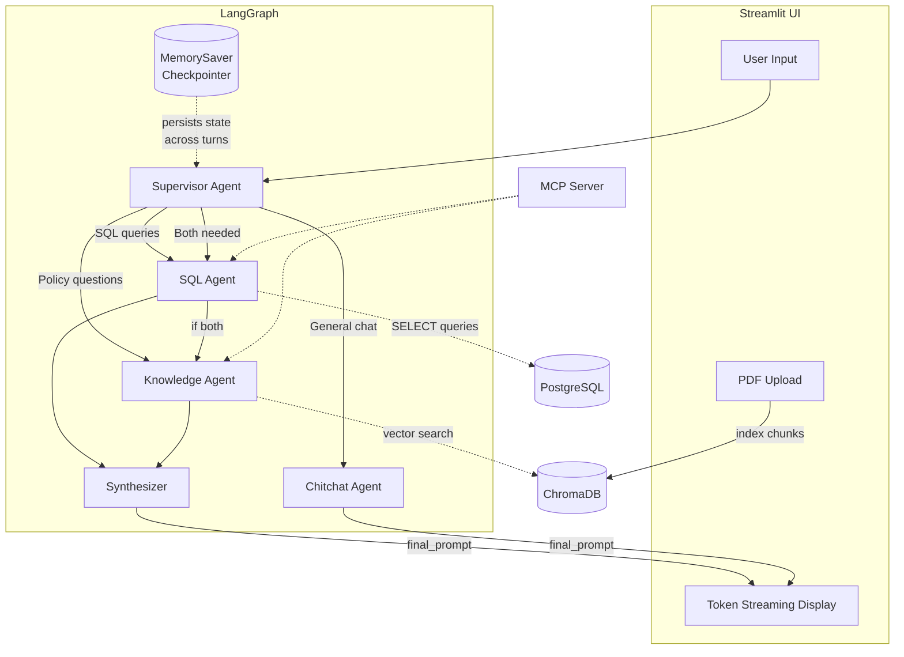

# TechCorp Solutions - AI Customer Support System


A production-grade **Generative AI Multi-Agent System** for customer support. Enables support executives to query customer data (SQL) and search company policy documents (RAG) using natural language, all orchestrated by a LangGraph supervisor agent.

---

## Architecture



---

## Features

- **Natural language SQL queries** over customer data (customers, tickets, interactions)
- **PDF document upload and RAG-based Q&A** with source citations
- **Multi-agent routing** with LangGraph supervisor (sql_agent, knowledge_agent, both, chitchat)
- **Token streaming** — final LLM responses stream in real-time to the UI
- **Conversation memory** via LangGraph MemorySaver checkpointer for multi-turn interactions
- **SQL self-correction** — auto-retries with error feedback when generated SQL fails (up to 2 retries)
- **Read-only SQL enforcement** with defense-in-depth (keyword blocklist + LLM prompt + retry validation)
- **Data source toggles** — enable/disable sample policy docs and SQL database independently from the sidebar
- **Document deduplication** — detects already-indexed PDFs, with optional replace/re-index
- **MCP server** for tool interoperability via Model Context Protocol
- **Dual LLM support**: Ollama (free, local) or OpenAI GPT-4o

---

## How It Works

When a user asks a question, the **Supervisor agent** classifies the intent and routes to the appropriate specialist. The **SQL Agent** generates and executes read-only queries against PostgreSQL. The **Knowledge Agent** retrieves relevant document chunks from ChromaDB and constructs a cited answer. For queries needing both data sources, the agents run sequentially and a **Synthesizer** merges their outputs into a single prompt. The graph handles routing and data retrieval without LLM generation — the final response is then **streamed token-by-token** to the Streamlit UI for minimal perceived latency.

---

## Tech Stack

| Component | Technology |
|-----------|-----------|
| Orchestration | LangGraph (StateGraph + MemorySaver) |
| LLM (default) | Ollama (llama3.1:8b) |
| LLM (optional) | OpenAI GPT-4o |
| Embeddings | sentence-transformers/all-mpnet-base-v2 |
| SQL Database | PostgreSQL 16 (Docker) |
| Vector Database | ChromaDB (persistent) |
| MCP Server | FastMCP |
| UI | Streamlit |
| PDF Processing | PyPDFLoader + RecursiveCharacterTextSplitter |

---

## Design Decisions

| Decision | Choice | Why |
|----------|--------|-----|
| Orchestration | LangGraph over CrewAI | Explicit state management, conditional routing, native checkpointing |
| Memory | LangGraph MemorySaver, not LangChain ConversationBufferMemory | Legacy memory classes are for the old Chain API; MemorySaver is the LangGraph-native pattern |
| Embeddings | all-mpnet-base-v2 (local) over OpenAI | Free, in-process, no API key, strong MTEB benchmark scores |
| Vector DB | ChromaDB over FAISS | Full database features (persistence, metadata filtering, CRUD) vs just a search index |
| SQL DB | PostgreSQL over SQLite | Production-standard, shows real infrastructure thinking |
| SQL Safety | 3-layer defense (blocklist + prompt + error handling) | Defense in depth — no single layer is foolproof |
| Streaming | Final LLM call streamed in UI, graph execution non-streamed | Minimizes perceived latency where it matters most |

---

## Prerequisites

- **Docker** and Docker Compose (Docker Desktop must be running)
- **Python 3.11 or 3.12** (recommended; 3.13 may have compatibility issues with some packages)
- **Ollama** (for local LLM) or an OpenAI API key

Install Ollama (macOS/Linux):
```bash
curl -fsSL https://ollama.com/install.sh | sh
```

---

## Quick Start

```bash
# 1. Clone the repository
git clone <repo-url>
cd customer-support-ai

# 2. Create environment file
cp .env.example .env

# 3. Start PostgreSQL (make sure Docker Desktop is running first)
docker-compose up -d
# Wait for healthcheck: docker-compose ps should show "healthy"

# 4. Create virtual environment and install dependencies
python3 -m venv .venv
source .venv/bin/activate
pip install -r requirements.txt

# 5. Install and start Ollama (skip if using OpenAI)
ollama serve  # Start the Ollama server — keep running in a separate terminal
ollama pull llama3.1:8b

# 6. Set up database and generate sample documents
python setup_database.py
# Expected output: 20 customers, 50 tickets, ~120 interactions, 2 PDFs generated

# 7. Launch the app
streamlit run app.py
```

---

## Using OpenAI (Optional)

To use OpenAI GPT-4o instead of Ollama, set your API key in `.env`:

```env
OPENAI_API_KEY=sk-your-key-here
```

The system automatically detects the key and switches to OpenAI.

---

## Observability (Optional)

Enable [LangSmith](https://smith.langchain.com) tracing to debug agent routing, LLM calls, and tool execution. Uncomment and set these in `.env`:

```env
LANGCHAIN_TRACING_V2=true
LANGCHAIN_API_KEY=ls-your-key-here
```

All LangGraph invocations will appear in your LangSmith dashboard with full trace details.

---

## MCP Server

Run the MCP server standalone for tool interoperability:

```bash
python mcp_server.py
```

This exposes three tools via stdio transport:
- `query_customer_data` — Natural language SQL queries
- `search_policies` — Knowledge base search
- `upload_policy_document` — PDF upload and indexing

---

## Sample Queries

| Query | Expected Agent | Description |
|-------|---------------|-------------|
| "What is the current refund policy?" | Knowledge Agent | Returns policy summary from PDF |
| "Give me Ema's profile and support ticket details" | SQL Agent | Returns customer data from PostgreSQL |
| "How many open tickets are there?" | SQL Agent | Returns count from database |
| "What is the SLA uptime guarantee?" | Knowledge Agent | Returns info from terms_of_service.pdf |
| "Which customers have critical priority tickets?" | SQL Agent | Returns filtered SQL data |
| "Hello, who are you?" | Chitchat Agent | Friendly greeting |

---

## Project Structure

```
customer-support-ai/
├── app.py                          # Streamlit UI (main entry point)
├── config.py                       # Configuration and LLM/embedding factories
├── utils.py                        # Shared helpers
├── setup_database.py               # DB schema + seed data + PDF generation
├── mcp_server.py                   # FastMCP server
├── docker-compose.yml              # PostgreSQL service
├── requirements.txt                # Python dependencies
├── .env.example                    # Environment template
├── .streamlit/config.toml          # Streamlit server configuration
├── agents/
│   ├── graph.py                    # LangGraph StateGraph assembly
│   ├── supervisor.py               # Supervisor/router agent
│   ├── sql_agent.py                # SQL specialist agent
│   ├── knowledge_agent.py          # RAG specialist agent
│   └── chitchat_agent.py           # General conversation agent
├── tools/
│   ├── sql_tools.py                # SQL query execution tools
│   └── kb_tools.py                 # Vector search + document upload
├── database/
│   └── chroma_db/                  # ChromaDB persistent storage
├── documents/
│   ├── company_refund_policy.pdf   # Sample refund policy
│   └── terms_of_service.pdf        # Sample terms of service
└── tests/
    └── test_agents.py              # Smoke tests
```

---

## Running Tests

```bash
python -m pytest tests/test_agents.py -v
```

---

## Troubleshooting

| Problem | Fix |
|---------|-----|
| `torchvision` warnings flooding the terminal | Harmless — Streamlit's file watcher triggers them. They don't affect functionality. |
| `connection refused` on database queries | Make sure PostgreSQL is running: `docker-compose ps`. Restart with `docker-compose up -d`. |
| Slow first response | Normal — the embedding model downloads on first run (~438MB). Subsequent starts use the cached model. |
| `ollama` command not found | Install Ollama: `curl -fsSL https://ollama.com/install.sh \| sh` |
| Ollama model not responding | Ensure `ollama serve` is running in a separate terminal and the model is pulled: `ollama pull llama3.1:8b` |

---

## Demo Video

https://drive.google.com/file/d/1188PXRoj_SFQxa1wq2lJHwn5oWHnzi3_/view?usp=sharing
